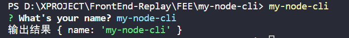

## 参考
该文章以这篇[从 0 构建自己的脚手架/CLI知识体系（万字） 🛠](https://juejin.cn/post/6966119324478079007)文章为基石，加上自己的实践。

- [🦊【前端工程化】为什么大厂都要开发自己的脚手架？🦄️](https://juejin.cn/post/7128597557634138148)
- [手把手教你写一个脚手架](https://juejin.cn/post/6932610749906812935)
- [【前端架构必备】手摸手带你搭建一个属于自己的脚手架](https://juejin.cn/post/7077717940941881358)
- [从 0 构建自己的脚手架/CLI知识体系（万字） 🛠](https://juejin.cn/post/6966119324478079007)

## 简介
搭建脚手架的目的就是 **快速的搭建项目的基本结构并提供项目规范和约定。** 常用的脚手架有 vue-cli、create-react-app、angular-cli 等等。目前使用的 Node 版本是 `14.13.1`。

## 一、脚手架的设计流程

> 脚手架基本工作流程如下：
> 1. 通过命令行交互询问用户问题
> 2. 根据用户回答的结果生成文件

### 1. 在命令行启动 cli
目标： 实现在命令行执行 my-node-cli 来启动我们的脚手架

#### 1.1 初始化项目
```shell
mkdir my-node-cli #新建项目目录 my-node-cli
cd my-node-cli 
npm init -y # 生成默认 package.json 文件
```

#### 1.2 新建程序入口文件 cli.js
```shell
code cli.js # 新建 cli.js 文件
```

在 package.json 文件中 `"main"` 字段，指定入口文件为 cli.js，`"bin"` 字段代表可执行文件的路径

> 关于package.json相关的，请看：[关于前端大管家 package.json，你知道多少？](https://juejin.cn/post/7023539063424548872) 

```shell
{
  "name": "my-node-cli",
  "version": "1.0.0",
  "description": "",
  "main": "cli.js",
  "bin": "cli.js",
  "scripts": {
    "test": "echo \"Error: no test specified\" && exit 1"
  },
  "author": "",
  "license": "ISC"
}
```

打开 cli.js 进行编辑

```JavaScript
#! /usr/bin/env node

// #! 符号的名称叫 Shebang，用于指定脚本的解释程序
// Node CLI 应用入口文件必须要有这样的文件头，否则会抛出 No such file or directory 错误
// 如果是Linux 或者 macOS 系统下还需要修改此文件的读写权限为 755
// 具体就是通过 chmod 755 cli.js 实现修改

// 用于测试作为入口文件cli.js是否成功执行
console.log('my-node-cli working~')
```

#### 1.3 npm link 链接到全局
那么 `npm link` 是什么呢？ 
[yarn link 与 npm link 使用及原理](https://juejin.cn/post/6844904164468768776)

```shell
npm link # or yarn link
```

注册成全局命令，这样在 powershell 或是 bash 之类的命令行都能使用 `my-node-cli` 这个命令了。

```shell
my-node-cli
```

成功打印 cli.js 中的信息即成功了

**问题：** 
> 1. my-node-cli : The term 'my-node-cli' is not recognized as the name of a cmdlet, function, script file, or operable program. Check the spelling of the name, or if a path was included, verify that the path is correct and try again.
> 2. bash: my-node-cli command not found

**解决：** 在 package.json 里面添加一行 `"type": "module"` 即可解决。

### 2. 询问用户信息
`vue create` 命令时，其中有一个步骤是交互式用户选择，这个交互式功能就是由 inquirer 实现的。

inquirer 支持 Confirm 确认，List 单选，Checkbox 多选等多种交互方式。

实现与询问用户信息的功能需要引入，文档看这里： [inquirer.js](https://github.com/SBoudrias/Inquirer.js/)

```shell
# 安装inquirer
npm install --save inquirer
```

接着我们在 cli.js 来设置我们的问题

**注意：** v9或以上的版本不再支持 `require('inquirer')` 这种 commonjs 的引入方式了。

```javascript
#! /usr/bin/env node

import inquirer from 'inquirer';

inquirer
  .prompt([
    /* Pass your questions in here */
    {
      type: 'input', //type： input, number, confirm, list, checkbox ... 
      name: 'name', // key 名
      message: 'What\'s your name?', // 提示信息
      default: 'my-node-cli' // 默认值
    }
  ])
  .then((answers) => {
    // Use user feedback for... whatever!!
    console.log('输出结果', answers);
  })
  .catch((error) => {
    if (error.isTtyError) {
      // Prompt couldn't be rendered in the current environment
    } else {
      // Something else went wrong
    }
  });
```

**问题：** SyntaxError: Cannot use import statement outside a module
**解决：** 在 package.json 里面添加一行 `"type": "module"` 即可解决。

解决-方案参考：
[SyntaxError: Cannot use import statement outside a module](https://stackoverflow.com/questions/58384179/syntaxerror-cannot-use-import-statement-outside-a-module)

顺着上个答案，来到这个：
[Node官方文档-modules](https://nodejs.org/api/modules.html)

**总结：** 官网说的很清楚，Node 有两种模块系统，`type` 字段可以是 `CommonJS` 和  `module`，分别指定了 require 和 import 加载。

在命令行输入 my-node-cli 看一下执行结果




### 3. 生成对应的文件
#### 3.1 新建模版文件夹

```shell
mkdir templates # 创建模版文件夹 
```

#### 3.2 新建 index.html 和 common.css 两个简单的示例文件

```html
<!DOCTYPE html>
<html lang="en">
<head>
  <meta charset="UTF-8">
  <meta http-equiv="X-UA-Compatible" content="IE=edge">
  <meta name="viewport" content="width=device-width, initial-scale=1.0">
  <title>
    <!-- ejs 语法 -->
    <%= name %>
  </title>
</head>
<body>
  <h1><%= name %></h1>
</body>

</html>
```

```css
/* common.css */
body {
  margin: 20px auto;
  background-color: azure;
}
```

此时的目录结构

```
my-node-cli           
├─ templates          
│  ├─ common.css      
│  └─ index.html      
├─ cli.js             
├─ package-lock.json  
└─ package.json       
```

#### 3.3 接着完善文件生成逻辑
这里借助 ejs 模版引擎将用户输入的数据渲染到模版文件上

```shell
npm install ejs --save
```

完善后到 cli.js

```javascript
#! /usr/bin/env node

const inquirer = require('inquirer')
const path = require('path')
const fs = require('fs')
const ejs = require('ejs')

inquirer.prompt([
  {
    type: 'input', //type：input,confirm,list,rawlist,checkbox,password...
    name: 'name', // key 名
    message: 'Your name', // 提示信息
    default: 'my-node-cli' // 默认值
  }
]).then(answers => {
  // 模版文件目录
  const destUrl = path.join(__dirname, 'templates'); 
  // 生成文件目录
  // process.cwd() 对应控制台所在目录
  const cwdUrl = process.cwd();
  // 从模版目录中读取文件
  fs.readdir(destUrl, (err, files) => {
    if (err) throw err;
    files.forEach((file) => {
      // 使用 ejs 渲染对应的模版文件
      // renderFile（模版文件地址，传入渲染数据）
      ejs.renderFile(path.join(destUrl, file), answers).then(data => {
        // 生成 ejs 处理后的模版文件
        fs.writeFileSync(path.join(cwdUrl, file) , data)
      })
    })
  })
})
```