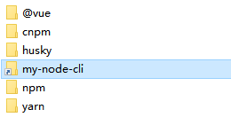
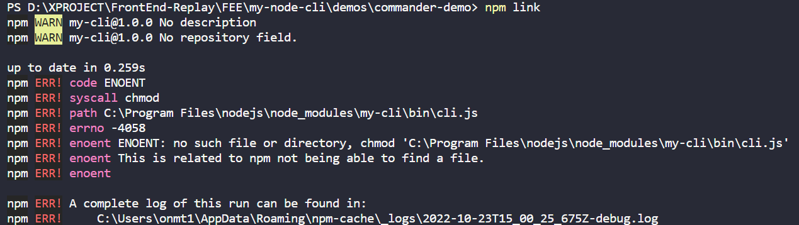

# 搭建脚手架 cli
## 参考
该文章以这篇[从 0 构建自己的脚手架/CLI知识体系（万字） 🛠](https://juejin.cn/post/6966119324478079007)文章为基石，加上自己的实践。

- [🦊【前端工程化】为什么大厂都要开发自己的脚手架？🦄️](https://juejin.cn/post/7128597557634138148)
- [手把手教你写一个脚手架](https://juejin.cn/post/6932610749906812935)
- [【前端架构必备】手摸手带你搭建一个属于自己的脚手架](https://juejin.cn/post/7077717940941881358)
- [从 0 构建自己的脚手架/CLI知识体系（万字） 🛠](https://juejin.cn/post/6966119324478079007)

## 简介
搭建脚手架的目的就是 **快速的搭建项目的基本结构并提供项目规范和约定。** 常用的脚手架有 vue-cli、create-react-app、angular-cli 等等。

脚手架是基于 Node 的应用，所以需要注意版本问题。目前使用的 Node 版本是 `14.13.1`，Npm 版本 `6.14.8`。

## 一、脚手架的设计流程

> 脚手架基本工作流程如下：
> 1. 通过命令行交互询问用户问题
> 2. 根据用户回答的结果生成文件

### 1. 在命令行启动 cli
目标： 实现在命令行执行 my-node-cli 来启动我们的脚手架

#### 1.1 初始化项目
```shell
mkdir my-node-cli #新建项目目录 my-node-cli
cd my-node-cli 
npm init -y # 生成默认 package.json 文件
```

#### 1.2 新建程序入口文件 cli.js
```shell
code cli.js # 新建 cli.js 文件
```

在 package.json 文件中 `"main"` 字段，指定入口文件为 cli.js，`"bin"` 字段代表可执行文件的路径，也可以自定义调用命令 `"bin": {"my-node-create": "cli.js"}`。

> 关于package.json相关的，请看：[关于前端大管家 package.json，你知道多少？](https://juejin.cn/post/7023539063424548872) 

```json
{
  "name": "my-node-cli", // 默认情况是以"name"为调用命令
  "version": "1.0.0",
  "description": "",
  "main": "cli.js",
  "bin": "cli.js", // 也可以自定义调用命令 "bin": {"my-node-create": "cli.js"},
  "scripts": {
    "test": "echo \"Error: no test specified\" && exit 1"
  },
  "author": "",
  "license": "ISC"
}
```

打开 cli.js 进行编辑

```JavaScript
#! /usr/bin/env node

// #! 符号的名称叫 Shebang，用于指定脚本的解释程序
// Node CLI 应用入口文件必须要有这样的文件头，否则会抛出 No such file or directory 错误
// 如果是Linux 或者 macOS 系统下还需要修改此文件的读写权限为 755
// 具体就是通过 chmod 755 cli.js 实现修改

// 用于测试作为入口文件cli.js是否成功执行
console.log('my-node-cli working~')
```

#### 1.3 npm link 链接到全局
直接运行 `my-node-cli` 会发生什么？

得到以下结果：
`bash: my-node-cli: command not found`

运行环境并不认识我们自定义的这个命令，如何介绍给它认识？那么就要说到 `npm link` 这个命令。

其原理是创建一个符号链接（symbolic link），将本地的模块链接到全局的node_modules文件夹中，使得全局可以直接调用本地的模块。

成功添加了，去全局的node_modules看看是否有这个文件


在 Node 目录下可以看到相关命令行文件。


```shell
npm link # or yarn link
```

注册成全局命令，这样在 powershell 或是 bash 之类的命令行都能使用 `my-node-cli` 这个命令了。

```shell
my-node-cli
```

成功打印 cli.js 中的信息即成功了

**问题：** 
> 1. my-node-cli : The term 'my-node-cli' is not recognized as the name of a cmdlet, function, script file, or operable program. Check the spelling of the name, or if a path was included, verify that the path is correct and try again.
> 2. bash: my-node-cli command not found

**解决：** 在 package.json 里面添加一行 `"type": "module"` 即可解决。

### 2. 询问用户信息
`vue create` 命令时，其中有一个步骤是交互式用户选择，这个交互式功能就是由 inquirer 实现的。

inquirer 支持 Confirm 确认，List 单选，Checkbox 多选等多种交互方式。

实现与询问用户信息的功能需要引入，文档看这里： [inquirer.js](https://github.com/SBoudrias/Inquirer.js/)

```shell
# 安装inquirer，安装到dev环境即可
npm install --save-dev inquirer
```

接着我们在 cli.js 来设置我们的问题

**注意：** v9或以上的版本不再支持 `require('inquirer')` 这种 commonjs 的引入方式了。

```javascript
#! /usr/bin/env node

import inquirer from 'inquirer';

inquirer
  .prompt([
    /* Pass your questions in here */
    {
      type: 'input', //type： input, number, confirm, list, checkbox ... 
      name: 'name', // key 名
      message: 'What\'s your name?', // 提示信息
      default: 'my-node-cli' // 默认值
    }
  ])
  .then((answers) => {
    // Use user feedback for... whatever!!
    console.log('输出结果', answers);
  })
  .catch((error) => {
    if (error.isTtyError) {
      // Prompt couldn't be rendered in the current environment
    } else {
      // Something else went wrong
    }
  });
```

**问题：** SyntaxError: Cannot use import statement outside a module
**解决：** 在 package.json 里面添加一行 `"type": "module"` 即可解决。

解决-方案参考：
[SyntaxError: Cannot use import statement outside a module](https://stackoverflow.com/questions/58384179/syntaxerror-cannot-use-import-statement-outside-a-module)

顺着上个答案，来到这个：
[Node官方文档-modules](https://nodejs.org/api/modules.html)

**总结：** 官网说的很清楚，Node 有两种模块系统，`type` 字段可以是 `CommonJS` 和  `module`，分别指定了 require 和 import 加载。

在命令行输入 my-node-cli 看一下执行结果


### 3. 生成对应的文件
#### 3.1 新建模版文件夹

```shell
mkdir templates # 创建模版文件夹 
```

#### 3.2 新建 index.html 和 common.css 两个简单的示例文件

```html
<!DOCTYPE html>
<html lang="en">
<head>
  <meta charset="UTF-8">
  <meta http-equiv="X-UA-Compatible" content="IE=edge">
  <meta name="viewport" content="width=device-width, initial-scale=1.0">
  <title>
    <!-- ejs 语法 -->
    <%= name %>
  </title>
</head>
<body>
  <h1><%= name %></h1>
</body>

</html>
```

```css
/* common.css */
body {
  margin: 20px auto;
  background-color: azure;
}
```

> 树形目录生成工具：[npm - treer](https://www.npmjs.com/package/treer)

```shell
# treer -i "排除目录名" -e "生成文件名.md"
treer -i "node_modules" -e "tree.md"
```

此时的目录结构

```
my-node-cli           
├─ templates          
│  ├─ common.css      
│  └─ index.html      
├─ cli.js             
├─ package-lock.json  
└─ package.json       
```

#### 3.3 接着完善文件生成逻辑
这里借助 ejs 模版引擎将用户输入的数据渲染到模版文件上

```shell
npm install --save-dev ejs
```

完善后到 cli.js

```javascript
#! /usr/bin/env node

import inquirer from 'inquirer';
import path from 'path';
import fs from 'fs';
import ejs from 'ejs';

inquirer
  .prompt([
    /* Pass your questions in here */
    {
      type: 'input', //type： input, number, confirm, list, checkbox ... 
      name: 'name', // key 名
      message: 'What\'s your name?', // 提示信息
      default: 'my-node-cli' // 默认值
    }
  ])
  .then((answers) => {
    // 脚手架所在的根目录
    const __dirname = 'D:/XPROJECT/FrontEnd-Replay/FEE/my-node-cli/';
    // 生成模板文件目录
    const destUrl = path.join(__dirname, 'templates'); 

    // process cwd() 方法返回 Node.js 进程当前工作的目录
    const cwdUrl = process.cwd()
    // 从模板目录中读取文件
    fs.readdir(destUrl, (err, files) => {
      if(err) throw err;
      files.forEach((file) => {
        /**
         * 使用 ejs 渲染对应的模板文件
         * renderFile（模板文件地址，传入渲染数据）
         * @param {string} 模板文件地址
         * @returns {Object} 传入渲染数据
         */
        ejs.renderFile(path.join(destUrl, file), answers).then(data => {
          // ejs 数据写入文件并生成在根目录
          fs.writeFileSync(path.join(cwdUrl, file), data)
        })
      })
    })
  })
  .catch((error) => {
    if (error.isTtyError) {
      // Prompt couldn't be rendered in the current environment
    } else {
      // Something else went wrong
    }
  });
```

同样，在控制台执行一下 `my-node-cli` ，此时 `index.html`、`common.css` 已经成功创建

我们打印一下当前的目录结构
```
my-node-cli           
├─ templates          
│  ├─ common.css      
│  └─ index.html      
├─ cli.js             
├─ common.css .................... 生成对应的 common.css 文件        
├─ index.html .................... 生成对应的 index.html 文件        
├─ package-lock.json  
└─ package.json       
```

打开生成的 index.html 文件看一下

```
<!DOCTYPE html>
<html lang="en">

<head>
  <meta charset="UTF-8">
  <meta http-equiv="X-UA-Csompatible" content="IE=edge">
  <meta name="viewport" content="width=device-width, initial-scale=1.0">
  <!-- ejs 语法 -->
  <title>
    my-node-cli
  </title>
</head>

<body>
  <h1>my-node-cli</h1>
</body>

</html>
```

用户输入的 `{ name: 'my-node-cli' }` 已经添加到了生成的文件中了

## 二、热门脚手架工具库

实际生产中搭建一个脚手架或者阅读其他脚手架源码的时候需要了解下面这些工具库

| 名称 | 简介 |
| --- | --- |
| [commander](https://github.com/tj/commander.js/blob/master/Readme_zh-CN.md) | 命令行自定义指令（提示文字） |
| [inquirer](https://github.com/SBoudrias/Inquirer.js/) | 命令行询问用户问题，记录回答结果 |
| [chalk](https://www.npmjs.com/package/chalk) | 控制台输出内容样式美化 |
| [ora](https://www.npmjs.com/package/ora) | 控制台 loading 样式 |
| [figlet](https://www.npmjs.com/package/figlet) | 控制台打印 logo |
| [easy-table](https://www.npmjs.com/package/easy-table) | 控制台输出表格 |
| [download-git-repo](https://www.npmjs.com/package/download-git-repo) | 下载远程模版 |
| [fs-extra](https://www.npmjs.com/package/fs-extra) | 系统fs模块的扩展，提供了更多便利的 API，并继承了fs模块的 API |
| [cross-spawn](https://www.npmjs.com/package/cross-spawn) | 支持跨平台调用系统上的命令 |

重点介绍下面这些，其他工具可以查看说明文档

### 1. commander 自定义命令行指令

更多用法 [中文文档](https://github.com/tj/commander.js/blob/master/Readme_zh-CN.md)

下面单独在 demos 的文件夹中创建项目 

#### 1.1 新建一个关于 Commander 的 Node Cli 项目
创建基本目录

```shell
mkdir demos #新建这个目录存放所有的demo
cd demos
mkdir commander-demo #新建项目目录 commander-demo
npm init -y # 生成默认 package.json 文件
```

```shell
mkdir bin # bin 文件夹通常放项目的启动文件或脚本
code cli.js # 新建 cli.js 文件
```

通过 `package.json` 安装 `commander` 依赖

```json
{
  "name": "commander-demo",
  "version": "1.0.0",
  "description": "",
  "main": "cli.js",
  "bin": {
    "commander": "./bin/cli.js"
  },
  "scripts": {
    "test": "echo \"Error: no test specified\" && exit 1"
  },
  "author": "",
  "license": "ISC",
  "devDependencies": {
    "commander": "^7.2.0"
  },
  "dependencies": {}
}
```

然后`npm i`安装依赖，主要目录结构：

```
commander-demo             
├─ bin                
│  └─ cli.js          
├─ package-lock.json  
└─ package.json              
```

完善 bin.js 代码

```javascript
#! /usr/bin/env node

const program = require('commander')

program
.version('0.1.0')
.command('create <name>')
.description('create a new project')
.action(name => { 
    // 打印命令行输入的值
    console.log("project name is " + name)
})

program.parse()
```

#### 1.3 npm link 链接到全局

-   执行 `npm link` 将应用 `my-cli` 链接到全局
-   完成之后，在命令行中执行 `my-cli`

**问题：** 报错 `ENOENT: no such file or directory`


**解决：** 首先可以通过报错信息可得知，找不到 `cli.js` 这个文件，到该目录看了下确实不在。检查了下，`cli.js` 确实放错位置了。

如果遇到错误可以使用 `npm unlink` 撤销全局链接，还可以指定包名 `npm unlink 包名` 删除。可以看到 `C:\ProgramFiles\nodejs\node_modules` 下的文件夹被删除了，如果没有就 `rm -rf 文件夹名` 或手动删除。

commander成功输出：
```shell
PS D:\XPROJECT\FrontEnd-Replay\FEE\my-node-cli\demos\commander-demo> commander
Usage: cli [options] [command]

Options:
  -V, --version   output the version number
  -h, --help      display help for command

Commands:
  create <name>   create a new project
  help [command]  display help for command
```

在 Commands 下面就出现了我们刚刚创建的 create 命令 `create <name>`，我们在命令行中运行一下，成功打印出来：

```shell
$ commander create my-app
project name is my-app
```

### 2. chalk 命令行美化工具
chalk（粉笔）可以**美化命令行中输出内容的样式**

#### 2.1 新建一个关于 chalk 的项目
为了方便复制 commander-demo 的项目到新的系项目 chalk-demo

安装依赖
```shell
npm install --save-dev chalk
```

#### 2.2 基本使用
改下 package.json 的名字为 chalk-demo

同样打开 bin/cli.js，编写以下代码：

```JavaScript
#! /usr/bin/env node

const program = require('commander')
const chalk = require('chalk')

program
.version('0.1.0')
.command('create <name>')
.description('create a new project')
.action(name => { 
    // 打印命令行输入的值

    // 文本样式
    console.log("project name is " + chalk.bold(name))

    // 颜色
    console.log("project name is " + chalk.cyan(name))
    console.log("project name is " + chalk.green(name))

    // 背景色
    console.log("project name is " + chalk.bgRed(name))

    // 使用RGB颜色输出
    console.log("project name is " + chalk.rgb(4, 156, 219).underline(name));
    console.log("project name is " + chalk.hex('#049CDB').bold(name));
    console.log("project name is " + chalk.bgHex('#049CDB').bold(name))
})

program.parse()
```

在命令行中运行项目 chalk-demo create my-app 看一下效果，结果报错了：

**问题：**
```shell
$ chalk-demo create my-app
internal/modules/cjs/loader.js:1080
      throw new ERR_REQUIRE_ESM(filename, parentPath, packageJsonPath);
      ^

Error [ERR_REQUIRE_ESM]: Must use import to load ES Module: D:\LAB\FrontEnd-Replay\FEE\my-node-cli\demos\chalk-demo\node_modules\chalk\source\index.js
require() of ES modules is not supported.
require() of D:\LAB\FrontEnd-Replay\FEE\my-node-cli\demos\chalk-demo\node_modules\chalk\source\index.js from D:\LAB\FrontEnd-Replay\FEE\my-node-cli\demos\chalk-demo\bin\cli.js is an ES module file as it is a .js file whose nearest parent package.json contains "type": "module" which defines all .js files in that package scope as ES modules.
Instead rename index.js to end in .cjs, change the requiring code to use import(), or remove "type": "module" from D:\LAB\FrontEnd-Replay\FEE\my-node-cli\demos\chalk-demo\node_modules\chalk\package.json.

    at Object.Module._extensions..js (internal/modules/cjs/loader.js:1080:13)
    at Module.load (internal/modules/cjs/loader.js:928:32)
    at Function.Module._load (internal/modules/cjs/loader.js:769:14)
    at Module.require (internal/modules/cjs/loader.js:952:19)
    at require (internal/modules/cjs/helpers.js:88:18)
    at Object.<anonymous> (D:\LAB\FrontEnd-Replay\FEE\my-node-cli\demos\chalk-demo\bin\cli.js:4:15)
    at Module._compile (internal/modules/cjs/loader.js:1063:30)
    at Object.Module._extensions..js (internal/modules/cjs/loader.js:1092:10)
    at Module.load (internal/modules/cjs/loader.js:928:32)
    at Function.Module._load (internal/modules/cjs/loader.js:769:14) {
  code: 'ERR_REQUIRE_ESM'
}
```


**回答：**
这是因为引用的chalk 5.0模块是一个ES Module，不支持require()引入了。而当前Node.js环境默认是支持CommonJS（require）规范的，不支持ES Module。可以通过以下方法解决这个问题：

1.  在引用chalk模块的地方使用ES Module的方式导入，即使用`import`语句代替`require`语句，例如：
    
    ```js
    import chalk from 'chalk';
    ```
2.  然后 cli.js 文件中改为以下：

```JavaScript
#! /usr/bin/env node

import commander from 'commander';
import chalk from 'chalk';

commander.program
.version('0.1.0')
.command('create <name>')
.description('create a new project')
.action(name => {
// code...
})

commander.program.parse()
```


**问题：** 我们注意到 commander-demo 项目中 commander 包是 require 引入的，也就是使用的是 commonJS 规范，而这个项目改为了 `"type": "module"` 为何依然可以正常运行呢？

**回答：** 因为项目中使用了 Babel 或者 webpack，它们可以将 ES6 的 import 语句转换成 CommonJS 的 require 语句，从而让你的代码可以在 CommonJS 环境中运行。简单理解是 import（ESModules） 同时兼容 require（commonJS）

[import 和 require 导入的区别？](/NodeJS/importAndRequire/README.md)

### 3. ora 命令行 loading 动效
复制 commander-demo 这个项目，同上操作

```shell
# 安装ora，安装到dev环境即可
npm install --save-dev ora
```

运行 `ora-demo create my-app` 可以看到 loading 成功加载

```shell
# 输出结果
$ ora-demo create my-app
project name is my-app
✔ Loading succeed
```

### 4. cross-spawn 跨平台 shell 工具
在脚手架里面，可以用来自动执行 shell 命令

复制 chalk-demo 这个项目，其它也是同上操作

```shell
npm i -D cross-spawn
```

同样打开 bin/cli.js，编写以下代码：
```JavaScript
#! /usr/bin/env node
import spawn from 'cross-spawn';
import chalk from 'chalk';

// 定义需要按照的依赖
const dependencies = ['vue', 'vuex', 'vue-router'];

// 执行安装
const child = spawn('npm', ['install', '-D'].concat(dependencies), { 
    stdio: 'inherit' 
});

// 监听执行结果
child.on('close', function(code) {
    // 执行失败
    if(code !== 0) {
        console.log(chalk.red('Error occurred while installing dependencies!'));
        process.exit(1);
    }
    // 执行成功
    else {
        console.log(chalk.cyan('Install finished'))
    }
})
```

可以看到相关依赖都下载并且安装成功了
```shell
$ cross-spawn-demo
npm WARN deprecated sourcemap-codec@1.4.8: Please use @jridgewell/sourcemap-codec instead
npm WARN cross-spawn-demo@1.0.0 No description
npm WARN cross-spawn-demo@1.0.0 No repository field.

+ vuex@4.1.0
+ vue-router@4.1.6
+ vue@3.2.47
added 24 packages from 44 contributors and audited 31 packages in 10.214s

3 packages are looking for funding
  run `npm fund` for details

found 0 vulnerabilities

Install finished
```